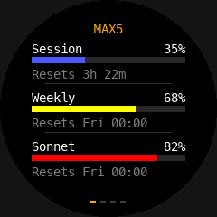
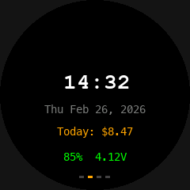
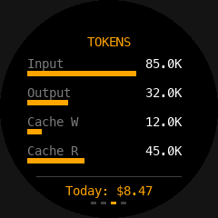
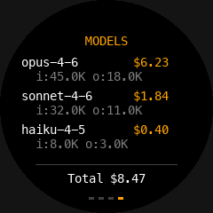

# Claude Usage Display [WIP]

[](https://coderabbit.ai)

A smart display that shows your [Claude Code](https://claude.ai/code) usage in real time — built with MicroPython on a tiny round touchscreen.

Inspired by [TokenEater](https://github.com/AThevon/TokenEater). Instead of a macOS menu bar widget, this puts the same data on a physical display you can glance at on your desk.

## Hardware

- [Seeed XIAO ESP32C3](https://wiki.seeedstudio.com/XIAO_ESP32C3_Getting_Started/) — RISC-V MCU with WiFi + BLE
- [Seeed Round Display for XIAO](https://wiki.seeedstudio.com/get_start_round_display/) — 240x240 TFT, capacitive touch, RTC, LiPo charging

The display plugs directly onto the XIAO — no wiring needed.

## How It Works

```
Anthropic OAuth Usage API
         │
server/server.py (your computer)
fetches utilization + reads local JSONL logs
         │
    HTTP (local WiFi)
         │
ESP32C3 + Round Display
polls every 10s, renders UI
```

The **relay server** fetches real-time utilization percentages from Anthropic's OAuth usage API (using your Claude Code credentials from macOS Keychain) and supplements with local JSONL log data for detail screens. The ESP32C3 fetches this over WiFi and renders it on the round display.

## Screenshots

<p align="center">
  
  
  
  
</p>

## UI Screens

Tap left/right halves of the screen to navigate.

| Screen | Shows |
|--------|-------|
| **Dashboard** | Session, Weekly, and Sonnet utilization bars with reset countdowns |
| **Clock** | Digital clock with date, daily cost, battery + voltage |
| **Tokens** | Bar chart of input/output/cache tokens |
| **Models** | Per-model cost and token breakdown |

Color coding: green (<50% of limit), yellow (50-80%), red (>80%).

## Setup

### 1. Install tools

```bash
pip install esptool mpremote
```

### 2. Flash firmware

Download the [gc9a01_mpy firmware](https://github.com/russhughes/gc9a01_mpy/blob/main/firmware/ESP32_GENERIC_C3/firmware_4MiB.bin) (MicroPython with GC9A01 display driver baked in).

Put the board in bootloader mode: hold **BOOT**, press **RESET**, release **BOOT**.

```bash
./tools/flash.sh firmware_4MiB.bin
```

### 3. Download fonts

Get these from [gc9a01_mpy/fonts/bitmap](https://github.com/russhughes/gc9a01_mpy/tree/main/fonts/bitmap) and place them in `fonts/`:

- `vga1_bold_16x32.py`
- `vga1_8x16.py`

### 4. Configure

```bash
cp config_example.py config.py
```

Edit `config.py` with your WiFi credentials and your computer's local IP:

```python
WIFI_SSID = "your-wifi"
WIFI_PASS = "your-password"
SERVER_URL = "http://192.168.1.100:8265"
```

### 5. Upload to device

```bash
./tools/upload.sh
# or specify port: ./tools/upload.sh /dev/cu.usbmodem1101
```

### 6. Start the relay server

```bash
python server/server.py              # auto-detect plan from Keychain
python server/server.py --plan max5  # or specify manually
python server/server.py --no-api     # JSONL-only fallback (no OAuth)
```

### 7. Reset the board

Press the reset button or power cycle. The display will connect to WiFi and start showing your usage.

## Battery Operation

The Round Display supports LiPo batteries via a JST 1.25 connector. The display works untethered on battery with WiFi.

WiFi TX power is reduced to 13dBm (from default 20dBm) to cut peak current draw — still enough for same-room range.

## Inspired By

- [TokenEater](https://github.com/AThevon/TokenEater) — macOS menu bar app for Claude Code usage (utilization data approach)
- [ccusage](https://github.com/ryoppippi/ccusage) — CLI tool for Claude Code usage analytics (token/cost calculation logic)
- [claude-monitor](https://github.com/Maciek-roboblog/Claude-Code-Usage-Monitor) — terminal-based Claude Code usage monitor

## License

MIT
